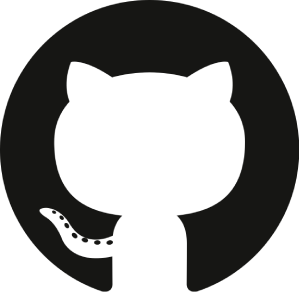

# 🚀 Project Showcase

Every developer has a journey — here’s mine in code!  
This showcase highlights the growth of my projects, from early experiments in JavaScript to advanced full‑stack apps with MERN and beyond.

## 📌 Quick Links

- 🌟 [Best Projects](#-best-projects)
- 🚀 [Full-Stack MERN Applications](#-full-stack-mern-applications)
- ⚡ [Next.js](#-nextjs)
- 🖧 [Express.js](#-expressjs)
- 🔴 [Laravel](#-laravel)
- 🟢 [Vue.js Projects](#-vuejs-projects)
- ⚛️ [React.js](#-reactjs)
- 🔷 [TypeScript](#-typescript)
- 📜 [JavaScript](#-javascript)
- 🎯 [Landing Pages](#-landing-pages)
- 🎨 [TailwindCSS](#-tailwindcss)
- 🅱️ [Bootstrap](#-bootstrap)
- 🎨 [HTML & CSS](#-html--css)
- 🌱 [Beginner Projects](#-beginner-projects)

---

## 🌟 Best Projects

| Project                                                                           |                                                                |                                                             |
| :-------------------------------------------------------------------------------- | :----------------------------------------------------------------------------------------------------------------------------------------------------------------------------------------------------------: | :-----------------------------------------------------------------------------------------------------------------------------------------------------------------------------------------------------: |
| [Hotel Haven (Frontend) **Team Project**](https://hotel-haven-37e44.web.app/)     |  |  |
| Hotel Haven (Backend) **Team Project**                                            |   |   |
| Revelshine (**Client Project**)                                                   |            |            |
| [Color Picker Chrome Extension](https://sheik-mostafizur.github.io/color-picker/) |          |          |

---

## 🚀 Full-Stack MERN Applications

| Project                                                                    |                                                                 |                                                              |
| :------------------------------------------------------------------------- | :-----------------------------------------------------------------------------------------------------------------------------------------------------------------------------------------------------------: | :------------------------------------------------------------------------------------------------------------------------------------------------------------------------------------------------------: |
| [Sportify (Client Side) **Team Project**](https://sportify-dd910.web.app/) |   |   |
| Sportify (Backend Side) **Team Project**                                   |  |  |
| ChallenGenius                                                              |          |          |
| SSLCOMMERZ MERN                                                            |        |        |

---

## ⚡ Next.js

| Project              |                                                                |                                                             |
| :------------------- | :----------------------------------------------------------------------------------------------------------------------------------------------------------------------------------------------------------: | :-----------------------------------------------------------------------------------------------------------------------------------------------------------------------------------------------------: |
| Next.js Dashboard    |      |      |
| Next Layout Tutorial |  |  |

---

## 🖧 Express.js

| Project              |                                                                |                                                             |
| :------------------- | :----------------------------------------------------------------------------------------------------------------------------------------------------------------------------------------------------------: | :-----------------------------------------------------------------------------------------------------------------------------------------------------------------------------------------------------: |
| Toyverse (Server)    |       |       |
| Poll Votes           |            |            |
| Attendance System    |     |     |
| Cloudinary ExpressJS |  |  |

---

## 🔴 Laravel

| Project                  |                                                                    |                                                                 |
| :----------------------- | :--------------------------------------------------------------------------------------------------------------------------------------------------------------------------------------------------------------: | :---------------------------------------------------------------------------------------------------------------------------------------------------------------------------------------------------------: |
| Laravel Users Table CRUD |  |  |

---

## 🟢 Vue.js Projects

| Project                                  |                                                    |                                                 |
| :--------------------------------------- | :----------------------------------------------------------------------------------------------------------------------------------------------------------------------------------------------: | :-----------------------------------------------------------------------------------------------------------------------------------------------------------------------------------------: |
| [Date UID](https://date-uid.vercel.app/) |  |  |

---

## ⚛️ React.js

| Project                                                                         |                                                                        |                                                                     |
| :------------------------------------------------------------------------------ | :------------------------------------------------------------------------------------------------------------------------------------------------------------------------------------------------------------------: | :-------------------------------------------------------------------------------------------------------------------------------------------------------------------------------------------------------------: |
| Purple Burzz                                                                    |            |            |
| Chef Recipe Hunter                                                              |     |     |
| [React Dept Hierarchy](https://venerable-strudel-54d7b2.netlify.app/)           |            |            |
| [SEO Hive](https://seo-hive.vercel.app/)                                        |                      |                      |
| Role Base Profile Switch                                                        |      |      |
| [Task 2 Junior Dev (Raintor)](https://task-2-junior-dev-by-raintor.vercel.app/) |  |  |
| [Todo Redux](https://sheikmostafizur-todo-redux.netlify.app/)                   |                    |                    |
| RTK Query                                                                       |                     |                     |
| Blood Bank                                                                      |                    |                    |
| Doc House                                                                       |                     |                     |
| Career Hub                                                                      |               |               |
| Knowledge Cafe                                                                  |           |           |
| Luxe Lunar                                                                      |                    |                    |
| World Clock                                                                     |                   |                   |
| Furniture E-Commerce                                                            |          |          |

---

## 🔷 TypeScript

| Project         |                                                           |                                                        |
| :-------------- | :-----------------------------------------------------------------------------------------------------------------------------------------------------------------------------------------------------: | :------------------------------------------------------------------------------------------------------------------------------------------------------------------------------------------------: |
| HTTP Status Kit |  |  |
| File Tree View  |   |   |

---

## 📜 JavaScript

| Project                                                                          |                                                                  |                                                               |
| :------------------------------------------------------------------------------- | :------------------------------------------------------------------------------------------------------------------------------------------------------------------------------------------------------------: | :-------------------------------------------------------------------------------------------------------------------------------------------------------------------------------------------------------: |
| [Quiz Hero](https://sheik-mostafizur.github.io/quiz-hero-phb7/)                  |          |          |
| [MealDB](https://sheik-mostafizur.github.io/mealdb-phb7/)                        |             |             |
| [Billionaire Diary](https://sheik-mostafizur.github.io/billionaire-diary-phb7/)  |  |  |
| [Geometry Genius](https://sheik-mostafizur.github.io/geometry-genius-phb7/)      |    |    |
| [AI Universe](https://sheik-mostafizur.github.io/ai-universe-phb7/)              |        |        |
| Country API                                                                      |             |             |
| [Simple Text Editor](https://sheik-mostafizur.github.io/simple-text-editor/)     |      |      |
| [Online Writing](https://sheik-mostafizur.github.io/online_writing/)             |          |          |
| [Game Winner Number](https://sheik-mostafizur.github.io/game-winner-number/)     |      |      |
| [Bank Deposit](https://sheik-mostafizur.github.io/bank-deposit/)                 |            |            |
| [Todo](https://sheik-mostafizur.github.io/todo/)                                 |                    |                    |
| [Search Products](https://sheik-mostafizur.github.io/search-products/)           |         |         |
| [Range to Date Filter](https://sheik-mostafizur.github.io/range-to-date-filter/) |    |    |
| [Cal Convector](https://sheik-mostafizur.github.io/cal-convector/)               |           |           |
| [Images](https://sheik-mostafizur.github.io/images/)                             |                  |                  |
| [Print](https://sheik-mostafizur.github.io/print/)                               |                   |                   |

---

## 🎯 Landing Pages

| Project                                                                  |                                                          |                                                       |
| :----------------------------------------------------------------------- | :----------------------------------------------------------------------------------------------------------------------------------------------------------------------------------------------------: | :-----------------------------------------------------------------------------------------------------------------------------------------------------------------------------------------------: |
| [Landing Pages (16+)](https://sheik-mostafizur.github.io/landing-pages/) |   |   |
| [Land v2.1 HTML](https://smart-smart-mutation.vercel.app/)               |  |  |

---

## 🎨 TailwindCSS

| Project                                                                     |                                                                |                                                             |
| :-------------------------------------------------------------------------- | :----------------------------------------------------------------------------------------------------------------------------------------------------------------------------------------------------------: | :-----------------------------------------------------------------------------------------------------------------------------------------------------------------------------------------------------: |
| [Tea House](https://sheik-mostafizur.github.io/tea-house-phb7/)             |        |        |
| [Penguin Fashion](https://sheik-mostafizur.github.io/penguin-fashion-phb7/) |  |  |

---

## 🅱️ Bootstrap

| Project                                                                         |                                                                  |                                                               |
| :------------------------------------------------------------------------------ | :------------------------------------------------------------------------------------------------------------------------------------------------------------------------------------------------------------: | :-------------------------------------------------------------------------------------------------------------------------------------------------------------------------------------------------------: |
| [Legal House](https://sheik-mostafizur.github.io/legal-house-phb7/)             |        |        |
| [Convention Center](https://sheik-mostafizur.github.io/convention-center-phb7/) |  |  |
| [Biker Zone)](https://sheik-mostafizur.github.io/biker-zone-phb7/)              |         |         |

---

## 🎨 HTML & CSS

| Project                                                                                  |                                                                             |                                                                          |
| :--------------------------------------------------------------------------------------- | :-----------------------------------------------------------------------------------------------------------------------------------------------------------------------------------------------------------------------: | :------------------------------------------------------------------------------------------------------------------------------------------------------------------------------------------------------------------: |
| [Portfolio Landing Page](https://sheik-mostafizur.github.io/portfolio-phb7/)             |                     |                     |
| [New Year New Me](https://sheik-mostafizur.github.io/new-year-new-me-assignment-1-phb7/) |  |  |
| [Donate Today](https://sheik-mostafizur.github.io/donate-today-phb7/)                    |                  |                  |
| [Leader Board ](https://sheik-mostafizur.github.io/leader-board-phb7/)                   |                  |                  |
| [Influencer Gear (PHB7)](https://sheik-mostafizur.github.io/influencer-gear-phb7/)       |               |               |
| [G3 Architects](https://sheik-mostafizur.github.io/g3-architects-assignment-2-phb7/)     |    |    |

---

## 🌱 Beginner Projects

| Project                                                                                      |                                                                      |                                                                   |
| :------------------------------------------------------------------------------------------- | :----------------------------------------------------------------------------------------------------------------------------------------------------------------------------------------------------------------: | :-----------------------------------------------------------------------------------------------------------------------------------------------------------------------------------------------------------: |
| HTML CSS Old Practices                                                                       |      |      |
| FAQ                                                                                          |                         |                         |
| [Random RGB Color Generator](https://sheik-mostafizur.github.io/random-rgb-color-generator/) |  |  |
| [Color Generator](https://sheik-mostafizur.github.io/color-generator/)                       |             |             |
| [Random Color Platte](https://sheik-mostafizur.github.io/random-color-platte/)               |         |         |
| [Form Fun With User](https://sheik-mostafizur.github.io/form-fun-with-user/)                 |          |          |
| Personal Website (Vite)                                                                      |            |            |
| Card CSS01                                                                                   |                  |                  |
| [Card Scroll Effect](https://sheik-mostafizur.github.io/card-scroll-effect/)                 |          |          |
| [Print Each Page Header](https://sheik-mostafizur.github.io/print-each-page-header/)         |      |      |
| [Draggable Slider](https://sheik-mostafizur.github.io/draggable-slider/)                     |            |            |
| [CSS Shadow](https://sheik-mostafizur.github.io/css-shadow/)                                 |                  |                  |
